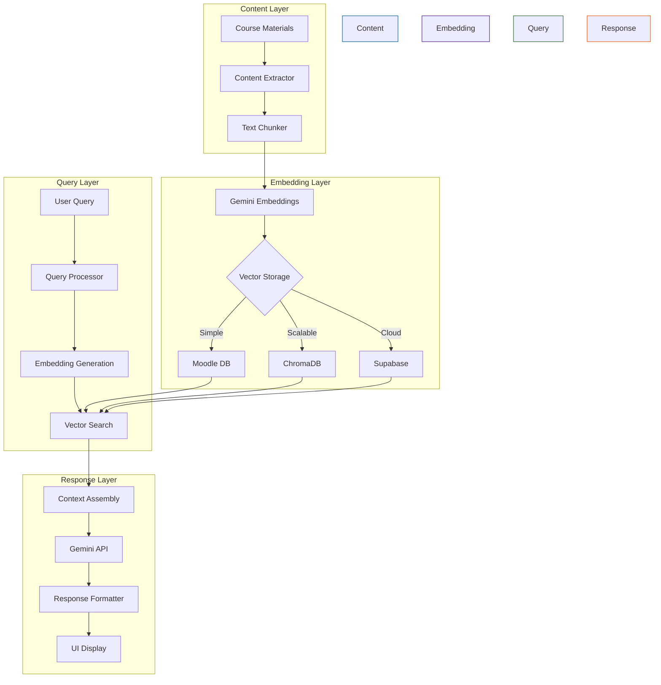

# Terus Rag Block for Moodle

## Overview
This Moodle block plugin implements Retrieval-Augmented Generation (RAG) functionality, allowing users to query course content using large language models. The plugin integrates with Gemini API to provide intelligent responses based on your course data.

## Features
- Implements RAG (Retrieval-Augmented Generation) architecture
- Integrates with Google's Gemini API
- Supports vector embeddings for semantic search
- Uses hybrid ranking with BM25 and cosine similarity
- Automatically processes and indexes course content
- Proper capability management for adding block instances

## How It Works

## Installation
1. Copy the terusrag folder into your Moodle blocks directory
2. Visit the notifications page (Site administration → Notifications) to complete the installation
3. Configure the API keys in the block settings
4. Add the block to your course or Dashboard

## Requirements
- Moodle 4.1.3 or later
- PHP 7.4 or later
- Access to Gemini API

## Configuration
1. Obtain a Gemini API key from Google AI Studio
2. Go to Site Administration → Plugins → Blocks → Terus RAG
3. Enter your API key and other required settings
4. Save changes and initialize the data process

## Core Files
- **provider_interface.php**: Interface defining LLM provider capabilities
- **gemini.php**: Implementation of the Gemini API integration
- **bm25.php**: BM25 ranking algorithm for text retrieval
- **llm.php**: Helper class with vector operations for LLM processing

## Capabilities
- block/terusrag:addinstance - Controls who can add the block to a course
- block/terusrag:myaddinstance - Controls who can add the block to their Dashboard

## Author
- Name: Khairu Aqsara
- Email: khairu@teruselearning.co.uk
- Website: https://teruselearning.co.uk

## License
This program is free software: you can redistribute it and/or modify it under the terms of the GNU General Public License as published by the Free Software Foundation, either version 3 of the License, or (at your option) any later version.
